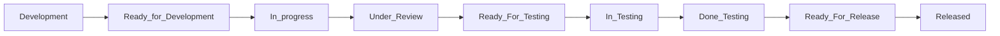
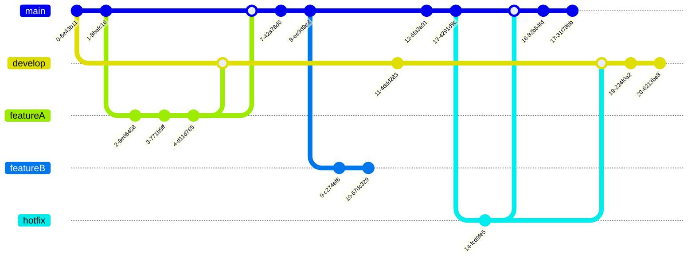
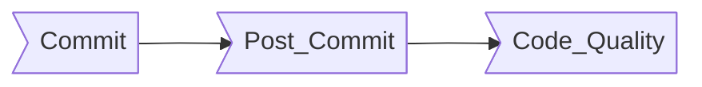
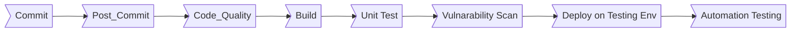
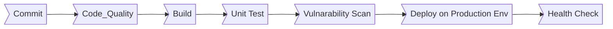

# Mr-Mandoob DevOps Transformation

## 1- Agile framework:
* Kanban board
* Mr-Mandoob board Status:

|          Stage           |                  Description                     |
|--------------------------|--------------------------------------------------|
| Development              |  description  |
| Ready_for_Development    |  description  |
| In_progress              |  description  |
| Under_Review             |  description  |
| Ready_For_Testing        |  description  |
| In_Testing               |  description  |
| Done_Testing             |  description  |
| Ready_For_Release        |  description  |
| Released                 |  description  |

## 2- Agile software:
* Jira

## 3- Git Branching Startegy:
* feature branching 

* Branchs:

|  Branch Name   |                        Description                              |
|----------------|------------------------------------------------------------------------------------------------|
| main           | it is protected long live branch map to production(only CTO can accept PRs). |
| develop        | it is protected long live branch map to testing environment (only CTO and Team lead can accept PRs).|
| feature branch | it is not protected branch related to certain feature it comes from main, merge to develop for testing and end by merging it to main branch.|
| hotfix branch  | it is not protected branch related to certain feature it comes from main,and end by merging it to main and develop branch. |

## 4- CI/CD Pipeline:

* feature branch pipeline

* hotfix branch pipeline

* merge request pipeline

* develop branch pipeline

* main branch pipeline

* Stages summary:

|    Pipeline Stage    |                        Description                              |
|----------------------|-----------------------------------------------------------------|
| Post_Commit          | verify the current branch has the latest changes on the main.   |
| Code_Quality         | Scan the code with sonarqube or any other PHP code quality tool.|
| Build                | Build docker image and push it to docker registy.               |
| Unit Test            | Run unit test                                                   |
| Vulnarability Scan   | Scan docker images if it has any vulnarabilities.               |
| Deploy               | Deploy to k8s cluster and run db migration.                     |
| Automation Testing   | Run Automation testing scripts.                                 |
| Health Check         | Hit an endpoit to verify that application is up and running     |

